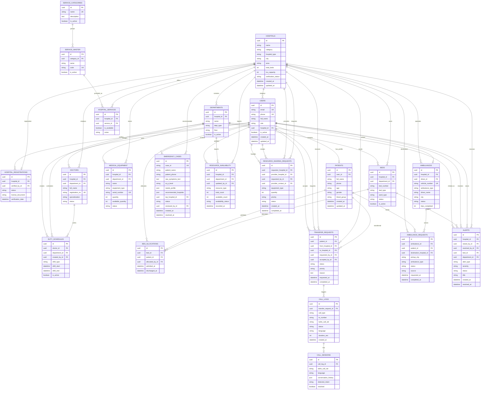

# Database Schema Report

## Project

**Healthcare Management System**

The database is designed for a hospital and emergency coordination platform. It stores users, hospitals, beds, patients, ambulance requests, emergency triage cases, supervisor alerts, hospital resources, transfer workflows, and AI call sessions.

The backend uses Django ORM models and PostgreSQL. Most core tables use UUID primary keys for safer distributed creation and easier API usage.

## Database Design Overview

The schema is organized around these main domains:

- **Authentication and roles**: system users and their hospital assignment.
- **Hospital registry**: hospitals, departments, doctors, duty schedules, services, and verification.
- **Patient operations**: patient profiles, admissions, discharges, and transfers.
- **Bed and resource management**: beds, bed allocations, equipment, resource availability, and sharing requests.
- **Ambulance management**: ambulance fleet, driver assignment, ambulance bookings, and trip status.
- **Emergency triage**: AI-generated severity, care needs, hospital recommendation, and outcome review.
- **Supervisor monitoring**: operational alerts and correction workflows.
- **Call handling**: Twilio call logs and AI call sessions.

## Main Tables

### 1. `users`

Stores login accounts and role information for all system users.

| Field | Type | Description |
|---|---|---|
| `id` | UUID, PK | Unique user identifier |
| `email` | Email, unique | Login username |
| `phone` | String, unique, nullable | User contact number |
| `full_name` | String | User full name |
| `role` | Enum | `reception`, `supervisor`, `admin`, `ambulance`, `public/patient` |
| `hospital_id` | FK, nullable | Linked hospital for staff users |
| `is_active` | Boolean | Account active status |
| `is_staff` | Boolean | Django staff access flag |
| `created_at` | DateTime | Account creation time |
| `updated_at` | DateTime | Last update time |

**Relationships**

- Many users can belong to one hospital.
- One user can optionally have one patient profile.
- One user can optionally be assigned as one ambulance driver.
- Users can create bed allocations, transfer requests, alerts, resource updates, and reviews.

### 2. `hospitals`

Stores hospital master data, location, capacity, contact details, and verification state.

| Field | Type | Description |
|---|---|---|
| `id` | UUID, PK | Unique hospital identifier |
| `name` | String | Hospital name |
| `category` | Enum | Government, private, trust, trauma center |
| `hospital_type` | Enum | Multispecialty, specialty, clinic |
| `address`, `city`, `area`, `district`, `state`, `pincode` | Text/String | Location details |
| `latitude`, `longitude` | Decimal, nullable | Geo-coordinates |
| `total_beds` | Integer | Declared total bed count |
| `icu_capacity` | Integer | ICU bed capacity |
| `phone`, `email`, `website` | String/Email/URL | Contact information |
| `status` | Enum | Active or inactive |
| `verification_status` | Enum | Verified, pending, rejected |
| `registration_date` | Date, nullable | Registration date |
| `license_number` | String, nullable | Hospital license |
| `created_at`, `updated_at` | DateTime | Audit timestamps |

**Relationships**

- One hospital has many departments, beds, doctors, ambulances, staff users, services, alerts, resource snapshots, and equipment records.
- One hospital has one hospital registration record.
- A hospital may be the source or destination in transfers and resource-sharing requests.
- A hospital can be selected as the top recommendation for an emergency case.

### 3. `departments`

Stores departments inside hospitals.

| Field | Type | Description |
|---|---|---|
| `id` | UUID, PK | Unique department identifier |
| `hospital_id` | FK | Parent hospital |
| `name` | String | Department name |
| `dept_type` | Enum | ICU, emergency, general, surgery, cardiology, neurology, etc. |
| `floor` | String, nullable | Floor or ward location |
| `is_active` | Boolean | Active status |
| `created_at` | DateTime | Creation time |

**Constraint**

- `hospital_id + name` must be unique.

### 4. `service_categories`

Stores top-level service categories such as imaging, diagnostics, critical care, or surgery.

| Field | Type | Description |
|---|---|---|
| `id` | UUID, PK | Unique category identifier |
| `name` | String, unique | Category name |
| `description` | Text, nullable | Category description |
| `is_active` | Boolean | Active status |
| `created_at` | DateTime | Creation time |

### 5. `service_master`

Stores reusable service definitions such as MRI, CT scan, blood bank, or pathology lab.

| Field | Type | Description |
|---|---|---|
| `id` | UUID, PK | Unique service identifier |
| `category_id` | FK | Service category |
| `name` | String | Service name |
| `code` | String, unique | Service code |
| `description` | Text, nullable | Service description |
| `is_active` | Boolean | Active status |
| `created_at` | DateTime | Creation time |

### 6. `hospital_services`

Junction table that maps hospitals to services they provide.

| Field | Type | Description |
|---|---|---|
| `id` | UUID, PK | Unique record identifier |
| `hospital_id` | FK | Hospital |
| `service_id` | FK | Service |
| `is_available` | Boolean | Current availability |
| `notes` | String, nullable | Availability notes |
| `added_at` | DateTime | Mapping creation time |

**Constraint**

- `hospital_id + service_id` must be unique.

### 7. `hospital_registrations`

Tracks hospital onboarding and verification.

| Field | Type | Description |
|---|---|---|
| `id` | UUID, PK | Unique registration identifier |
| `hospital_id` | One-to-one FK | Registered hospital |
| `verified_by_id` | FK, nullable | Verifying admin/supervisor |
| `status` | Enum | Pending, approved, rejected |
| `license_document` | File, nullable | Uploaded proof document |
| `rejection_reason` | Text, nullable | Reason if rejected |
| `registration_date` | Date | Submission date |
| `verification_date` | DateTime, nullable | Review date |

### 8. `doctors`

Stores doctor information for hospitals and departments.

| Field | Type | Description |
|---|---|---|
| `id` | UUID, PK | Unique doctor identifier |
| `hospital_id` | FK | Hospital |
| `department_id` | FK, nullable | Department |
| `full_name` | String | Doctor name |
| `registration_no` | String, unique | Medical council registration number |
| `specialization` | Enum | Cardiology, neurology, ICU, emergency, etc. |
| `qualification` | String, nullable | Medical qualification |
| `phone`, `email` | String/Email, nullable | Contact details |
| `experience_years` | Integer | Experience |
| `status` | Enum | Active, inactive, on leave |
| `created_at`, `updated_at` | DateTime | Audit timestamps |

### 9. `duty_schedules`

Stores doctor duty shifts.

| Field | Type | Description |
|---|---|---|
| `id` | UUID, PK | Unique schedule identifier |
| `doctor_id` | FK | Doctor |
| `department_id` | FK, nullable | Department |
| `shift_type` | Enum | Morning, evening, night, full day, custom |
| `shift_start` | DateTime | Shift start |
| `shift_end` | DateTime | Shift end |
| `is_active` | Boolean | Active duty status |
| `notes` | Text, nullable | Notes |
| `created_by_id` | FK, nullable | User who created schedule |
| `created_at` | DateTime | Creation time |

### 10. `patients`

Stores patient demographic and medical profile data.

| Field | Type | Description |
|---|---|---|
| `id` | UUID, PK | Unique patient identifier |
| `user_id` | One-to-one FK, nullable | Linked user account |
| `full_name` | String | Patient name |
| `phone` | String | Contact number |
| `email` | Email, nullable | Email |
| `age` | Integer, nullable | Age |
| `gender` | Enum, nullable | Male, female, other |
| `blood_group` | Enum, nullable | Blood group |
| `address`, `city`, `area` | Text/String, nullable | Address details |
| `emergency_contact_name` | String, nullable | Emergency contact name |
| `emergency_contact_phone` | String, nullable | Emergency contact phone |
| `known_allergies` | Text, nullable | Allergy information |
| `chronic_conditions` | Text, nullable | Existing conditions |
| `created_at`, `updated_at` | DateTime | Audit timestamps |

### 11. `beds`

Stores bed inventory and availability.

| Field | Type | Description |
|---|---|---|
| `id` | UUID, PK | Unique bed identifier |
| `hospital_id` | FK | Hospital |
| `department_id` | FK, nullable | Department |
| `bed_number` | String | Bed number/code |
| `bed_type` | Enum | ICU, general, ventilator, emergency, private, semi-private |
| `ward_type` | Enum | ICU ward, general ward, emergency ward, private room, NICU, PICU |
| `status` | Enum | Available, occupied, reserved, maintenance |
| `is_active` | Boolean | Active bed flag |
| `notes` | Text, nullable | Notes |
| `last_updated` | DateTime | Last update time |
| `created_at` | DateTime | Creation time |

**Constraint**

- `hospital_id + bed_number` must be unique.

### 12. `bed_allocations`

Tracks patient admission and discharge for beds.

| Field | Type | Description |
|---|---|---|
| `id` | UUID, PK | Unique allocation identifier |
| `bed_id` | FK | Allocated bed |
| `patient_id` | FK | Patient |
| `allocated_by_id` | FK, nullable | Reception/admin user |
| `admitted_at` | DateTime | Admission time |
| `discharged_at` | DateTime, nullable | Discharge time |
| `notes` | Text, nullable | Admission notes |

### 13. `medical_equipment`

Stores hospital equipment and availability counts.

| Field | Type | Description |
|---|---|---|
| `id` | UUID, PK | Unique equipment identifier |
| `hospital_id` | FK | Hospital |
| `department_id` | FK, nullable | Department |
| `name` | String | Equipment name |
| `equipment_type` | String | Equipment category/type |
| `manufacturer` | String, nullable | Manufacturer |
| `model_number` | String, nullable | Model number |
| `serial_number` | String, unique, nullable | Serial number |
| `quantity` | Integer | Total quantity |
| `available_quantity` | Integer | Available quantity |
| `status` | Enum | Available, in use, maintenance, inactive |
| `last_used` | DateTime, nullable | Last used time |
| `installation_date` | Date, nullable | Installation date |
| `next_maintenance` | Date, nullable | Maintenance due date |
| `created_at`, `updated_at` | DateTime | Audit timestamps |

### 14. `transfer_requests`

Stores inter-hospital patient transfer requests.

| Field | Type | Description |
|---|---|---|
| `id` | UUID, PK | Unique transfer identifier |
| `patient_id` | FK | Patient being transferred |
| `from_hospital_id` | FK | Source hospital |
| `to_hospital_id` | FK, nullable | Destination hospital |
| `requested_by_id` | FK, nullable | User who requested transfer |
| `accepted_by_id` | FK, nullable | User who accepted transfer |
| `status` | Enum | Pending, accepted, rejected, completed, cancelled |
| `priority` | Enum | Critical, high, medium, low |
| `reason` | Text | Transfer reason |
| `required_bed_type` | String, nullable | Required bed type |
| `required_services` | Text, nullable | Required service codes |
| `rejection_reason` | Text, nullable | Rejection reason |
| `notes` | Text, nullable | Additional notes |
| `requested_at` | DateTime | Request time |
| `responded_at` | DateTime, nullable | Accept/reject time |
| `completed_at` | DateTime, nullable | Completion time |

### 15. `ambulances`

Stores ambulance fleet and driver assignment.

| Field | Type | Description |
|---|---|---|
| `id` | UUID, PK | Unique ambulance identifier |
| `hospital_id` | FK, nullable | Operating hospital |
| `vehicle_number` | String, unique | Vehicle registration number |
| `ambulance_type` | Enum | Basic, advanced, ICU, neonatal, mortuary |
| `driver_id` | One-to-one FK, nullable | Assigned ambulance driver user |
| `driver_name`, `driver_phone`, `driver_license` | String | Driver details |
| `city`, `area` | String | Operating location |
| `latitude`, `longitude` | Decimal, nullable | Current location |
| `status` | Enum | Available, on trip, maintenance, inactive |
| `trips_completed` | Integer | Completed trip count |
| `service_rating` | Decimal | Average rating |
| `is_active` | Boolean | Active status |
| `created_at`, `updated_at` | DateTime | Audit timestamps |

### 16. `ambulance_requests`

Stores ambulance bookings and trip lifecycle data.

| Field | Type | Description |
|---|---|---|
| `id` | UUID, PK | Unique request identifier |
| `ambulance_id` | FK, nullable | Assigned ambulance |
| `patient_id` | FK, nullable | Patient |
| `destination_hospital_id` | FK, nullable | Target hospital |
| `pickup_address` | Text | Pickup location |
| `pickup_latitude`, `pickup_longitude` | Decimal, nullable | Pickup coordinates |
| `pickup_city` | String | Pickup city |
| `ambulance_type` | Enum | Requested ambulance type |
| `status` | Enum | Pending, accepted, en route, picked up, completed, cancelled |
| `source` | Enum | Patient portal or reception portal |
| `requester_name`, `requester_phone` | String | Requester contact |
| `requested_at`, `accepted_at`, `picked_up_at`, `completed_at` | DateTime | Trip timestamps |
| `response_time_sec` | Integer, nullable | Time to accept |
| `trip_duration_sec` | Integer, nullable | Pickup to completion time |
| `patient_rating` | Integer, nullable | Patient rating |
| `notes`, `cancellation_reason` | Text, nullable | Notes |

### 17. `emergency_cases`

Stores AI-assisted emergency triage and hospital routing results.

| Field | Type | Description |
|---|---|---|
| `id` | UUID, PK | Unique emergency case identifier |
| `case_id` | String, unique | Human-readable emergency case ID |
| `patient_name`, `patient_age`, `patient_phone`, `patient_gender` | String/Integer | Patient information |
| `patient_lat`, `patient_lng` | Float, nullable | Patient coordinates |
| `raw_symptoms_text` | Text | Original symptoms input |
| `known_conditions` | Text, nullable | Existing conditions |
| `ai_p_level` | Enum, nullable | P1, P2, P3, P4 severity |
| `ai_severity_label` | String, nullable | AI severity label |
| `ai_doctor_category` | String, nullable | Required doctor category |
| `ai_confidence` | Enum | High, medium, low |
| `ai_reasoning` | Text, nullable | AI explanation |
| `ai_red_flags` | JSON | Red flag symptoms |
| `ai_possible_conditions` | JSON | Possible diagnoses |
| `ai_requires_ambulance`, `ai_requires_icu`, `ai_was_escalated` | Boolean | AI care flags |
| `needs_profile` | JSON, nullable | Required bed/service/department profile |
| `recommended_hospitals` | JSON | Ranked hospital suggestions |
| `top_hospital_id` | FK, nullable | Best recommended hospital |
| `routing_explanation` | Text, nullable | Routing explanation |
| `status` | Enum | Incoming, dispatched, resolved, flagged for review, cancelled |
| `actual_p_level` | Enum, nullable | Final verified severity |
| `outcome_notes` | Text, nullable | Resolution notes |
| `was_undertriaged`, `was_overtriaged` | Boolean, nullable | AI accuracy flags |
| `reviewed_by_id` | FK, nullable | Reviewer user |
| `created_at`, `resolved_at` | DateTime | Lifecycle timestamps |

**Indexes**

- `status`
- `ai_p_level`
- `created_at`
- `was_undertriaged`

### 18. `alerts`

Stores supervisor alerts.

| Field | Type | Description |
|---|---|---|
| `id` | UUID, PK | Unique alert identifier |
| `hospital_id` | FK | Hospital |
| `raised_by_id` | FK, nullable | User who raised alert |
| `resolved_by_id` | FK, nullable | User who resolved alert |
| `bed_id` | FK, nullable | Related bed |
| `department_id` | FK, nullable | Related department |
| `alert_type` | Enum | Long occupancy, resource mismatch, data inconsistency, etc. |
| `severity` | Enum | High, medium, low |
| `status` | Enum | Open, investigating, resolved, dismissed |
| `title` | String | Alert title |
| `description` | Text | Alert detail |
| `resolution_note` | Text, nullable | Resolution note |
| `meta_data` | JSON | Extra alert metadata |
| `created_at`, `updated_at`, `resolved_at` | DateTime | Audit timestamps |

### 19. `resource_availability`

Stores periodic resource availability snapshots.

| Field | Type | Description |
|---|---|---|
| `id` | UUID, PK | Unique snapshot identifier |
| `hospital_id` | FK | Hospital |
| `department_id` | FK, nullable | Department |
| `updated_by_id` | FK, nullable | User who updated |
| `resource_type` | Enum | Bed, ventilator, ICU bed, oxygen, blood, equipment |
| `total_count` | Integer | Total count |
| `available_count` | Integer | Available count |
| `availability_status` | Enum | Available, unavailable, limited |
| `notes` | Text, nullable | Notes |
| `recorded_at` | DateTime | Snapshot time |

### 20. `resource_sharing_requests`

Stores resource-sharing requests between hospitals.

| Field | Type | Description |
|---|---|---|
| `id` | UUID, PK | Unique request identifier |
| `requester_hospital_id` | FK | Hospital requesting resource |
| `provider_hospital_id` | FK, nullable | Hospital providing resource |
| `equipment_type` | String | Requested equipment/resource |
| `quantity` | Integer | Quantity requested |
| `priority` | Enum | Critical, high, medium, low |
| `status` | Enum | Pending, accepted, rejected, shipped, received, completed, cancelled |
| `requested_by_id` | FK, nullable | Requesting user |
| `provider_contact_id` | FK, nullable | Provider-side contact user |
| `reason` | Text | Reason for request |
| `rejection_reason` | Text, nullable | Rejection reason |
| `notes` | Text, nullable | Notes |
| `created_at`, `updated_at`, `responded_at`, `completed_at` | DateTime | Lifecycle timestamps |

### 21. `call_logs`

Stores Twilio and AI call records.

| Field | Type | Description |
|---|---|---|
| `id` | UUID, PK | Unique call identifier |
| `call_type` | Enum | Transfer notification or user AI agent |
| `to_number` | String | Called number |
| `twilio_call_sid` | String, nullable | Twilio call SID |
| `status` | Enum | Initiated, ringing, in progress, completed, failed, no answer |
| `language` | Enum | English or Hindi |
| `duration_sec` | Integer, nullable | Call duration |
| `transfer_request_id` | FK, nullable | Linked transfer request |
| `created_at`, `updated_at` | DateTime | Audit timestamps |

### 22. `call_sessions`

Stores AI call conversation context.

| Field | Type | Description |
|---|---|---|
| `id` | UUID, PK | Unique session identifier |
| `call_log_id` | One-to-one FK | Linked call log |
| `twilio_call_sid` | String, indexed | Twilio call SID |
| `language` | String | Conversation language |
| `conversation_history` | JSON | AI conversation turns |
| `detected_intent` | String, nullable | Detected user intent |
| `user_city` | String, nullable | Detected user city |
| `resolved` | Boolean | Whether the issue was resolved |
| `meta_data` | JSON | Extra session data |
| `created_at`, `updated_at` | DateTime | Audit timestamps |

## Important Constraints

| Table | Constraint |
|---|---|
| `users` | `email` unique, `phone` unique when provided |
| `hospitals` | UUID primary key |
| `departments` | Unique department name per hospital |
| `service_categories` | `name` unique |
| `service_master` | `code` unique |
| `hospital_services` | Unique service per hospital |
| `doctors` | `registration_no` unique |
| `beds` | Unique bed number per hospital |
| `medical_equipment` | `serial_number` unique when provided |
| `ambulances` | `vehicle_number` unique |
| `emergency_cases` | `case_id` unique |
| `call_sessions` | One session per call log |

## Database E-R Diagram

## Normalization Notes

- Hospital services are normalized using `service_categories`, `service_master`, and `hospital_services`.
- Staff, drivers, supervisors, admins, and patients share one `users` table with role-based access.
- Patient admissions are separated from beds using `bed_allocations`, which preserves admission and discharge history.
- Ambulance fleet records are separate from ambulance requests, allowing one ambulance to serve many trips.
- Transfer requests and resource-sharing requests are separate because they represent different operational workflows.
- AI triage outputs use JSON fields for flexible clinical reasoning, ranked hospital recommendations, and model feedback data.

## Summary

This schema supports the project requirements for hospital management, emergency triage, bed allocation, patient transfers, ambulance dispatch, supervisor monitoring, and AI-assisted decision support. The design combines normalized operational tables with selected JSON fields where the data is dynamic, AI-generated, or best stored as structured metadata.
