# Healthcare Management System - Report Diagrams

These diagrams are written in Mermaid format. You can paste each code block into a Mermaid-supported editor, Markdown report, or diagram exporter to generate images for your project report.

## 1. High-Level System Architecture

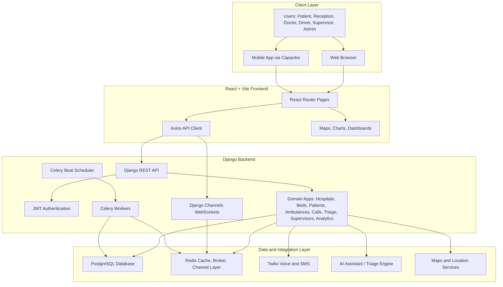

## 2. Use Case Diagram

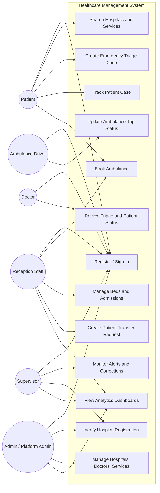

## 3. Main Database ER Diagram

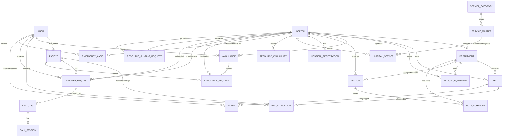

## 4. UML Class Diagram - Core Domain

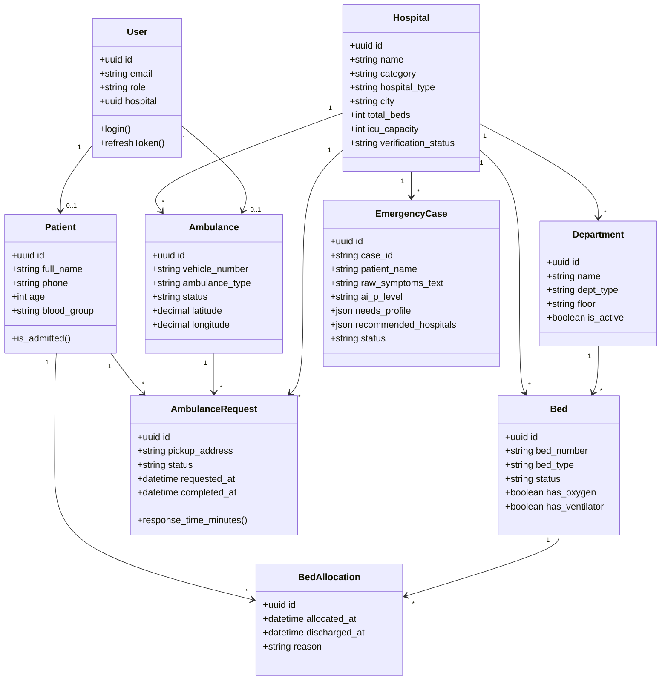

## 5. Authentication and Role-Based Access Flow

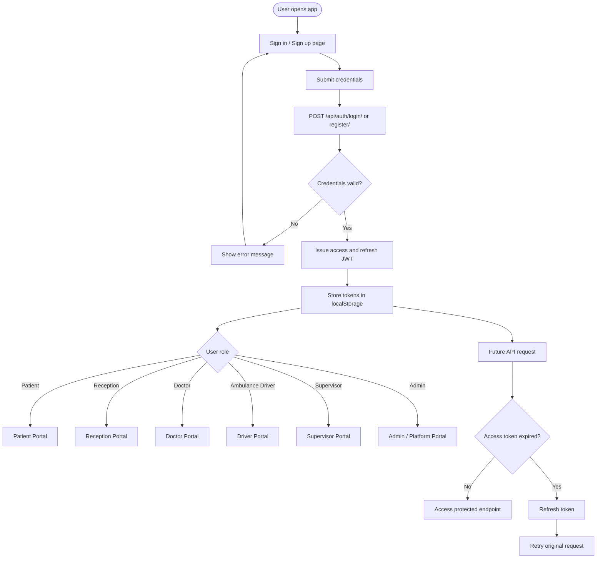

## 6. Emergency AI Triage and Hospital Routing Flow

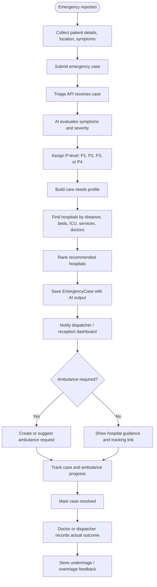

## 7. Ambulance Booking and Dispatch Sequence

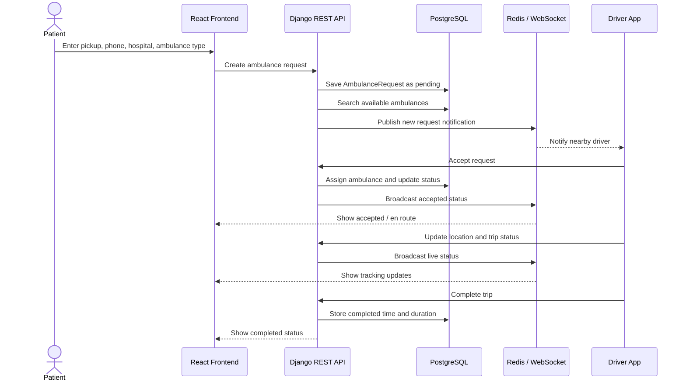

## 8. Bed Admission and Discharge Flow

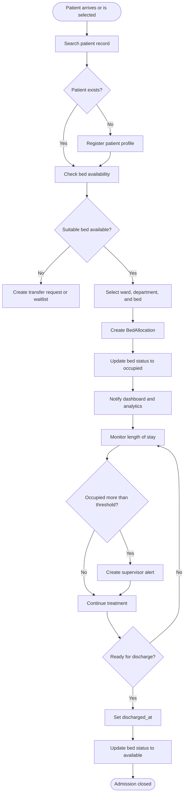

## 9. Patient Transfer Request Flow

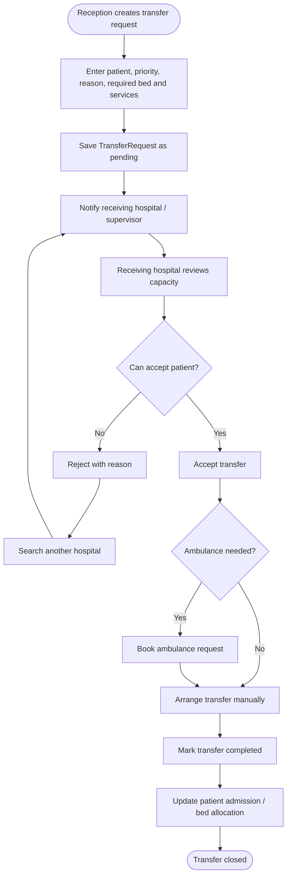

## 10. Supervisor Monitoring Flow

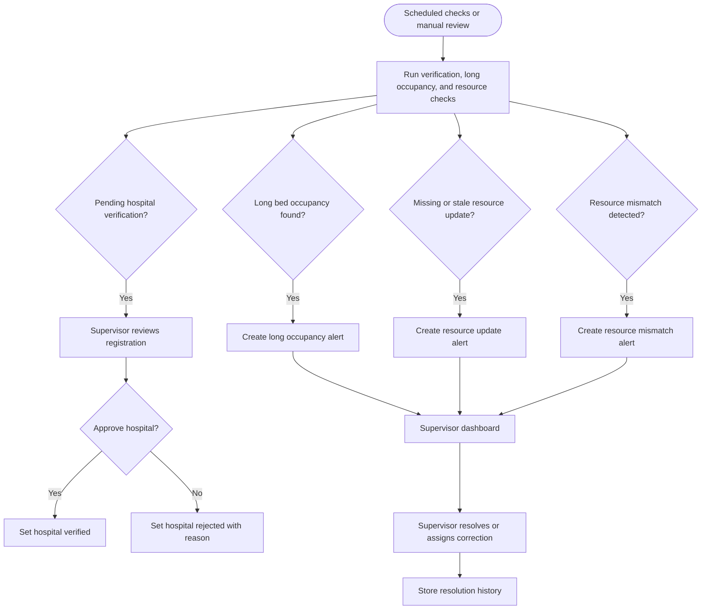

## 11. Real-Time Notification Flow

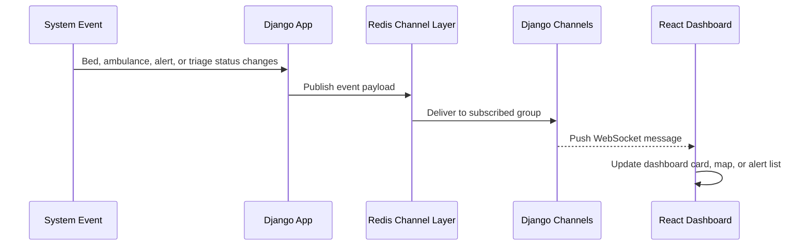

## 12. Deployment Diagram

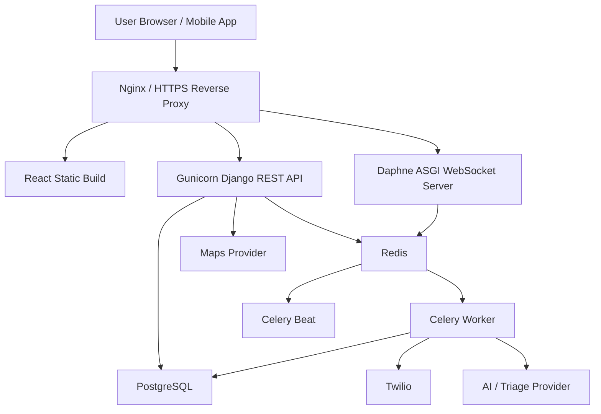
