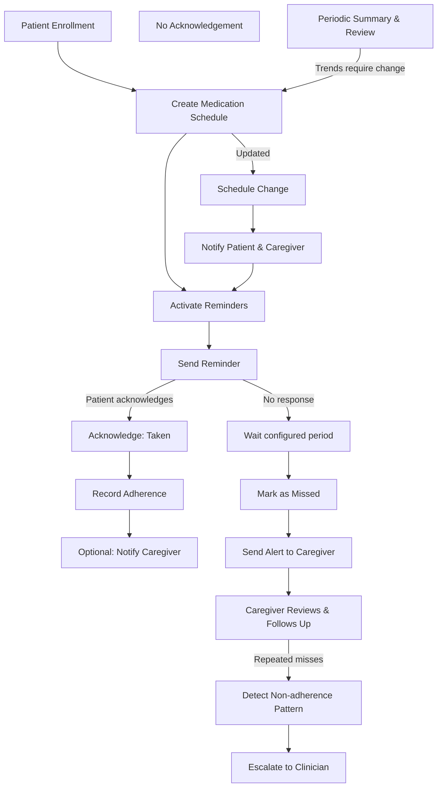

Intelligent Medication Adherence Monitoring System — Workflow & Flow Diagram

1. Workflow Summary

- Enrollment: Patient and caregiver details are recorded and a medication schedule is created.
- Activation: Reminders are activated for scheduled doses; patient and caregiver are notified of the schedule.
- Daily Routine: At each scheduled time the system sends a reminder to the patient.
  - If the patient acknowledges taking the dose: record adherence and optionally notify caregiver.
  - If the patient does not acknowledge within a configured wait period: mark as missed and trigger alerts.
- Escalation: Missed dose alerts are delivered to caregivers; repeated or consecutive misses escalate to clinicians.
- Schedule Changes: When a schedule or medication is updated, notify patient and caregiver and apply the new schedule.
- Periodic Review: Weekly/monthly summaries are generated for caregivers and clinicians to review trends and plan interventions.

2. Detailed Step-by-Step Workflow

- Patient Enrollment
  - Collect patient identity and contact details.
  - Assign caregiver(s) and emergency contacts.
  - Enter medication list and schedule (dose, time, frequency).
  - Confirm activation and notify stakeholders.

- Reminder Delivery
  - At scheduled time, send reminder to patient.
  - Log the reminder event with timestamp.

- Patient Response Handling
  - Acknowledge (Taken)
    - Patient taps acknowledge -> record timestamp as successful dose -> update adherence history -> optional confirmation to caregiver.
  - Missed (No Acknowledgement)
    - After configured wait time, mark dose as missed -> send alert to caregiver -> record missed event.

- Caregiver Interaction
  - Receive alert -> view patient status and recent history -> contact patient or assist as needed -> mark follow-up actions.

- Escalation Rules
  - Single missed dose -> caregiver alert and follow-up suggestion.
  - Multiple consecutive misses or pattern of non-adherence -> escalate to clinician with summary report.

- Schedule Adjustment
  - Caregiver or clinician updates schedule -> system sends update notifications -> new schedule becomes active.

- Reporting and Review
  - Generate weekly/monthly adherence summaries -> caregiver/clinician reviews -> decide interventions or schedule changes.

3. Text-based Flow Diagram (Mermaid)

4. How to Use This Diagram

- Read top-to-bottom for normal daily flow (enrollment -> reminders -> acknowledgement).
- Follow the missed-dose path to see alert and escalation behavior.
- The diagram captures schedule change and periodic review loops.

End of workflow file.
